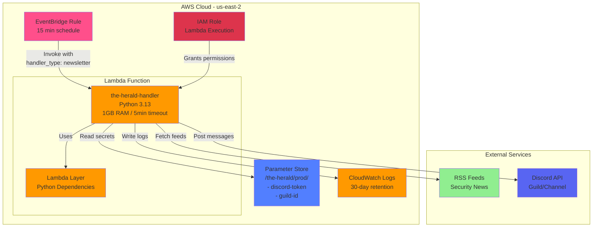

# DSB Discord Bot - The Herald


[](https://discord.gg/enMmUNq8jc)

<p align="center">
  
</p>

## Overview... in a mystical sense

The Herald is the ever-watchful and enigmatic bot, designed to guide, inform, and protect the DSB community in the sprawling digital world. True to its name, The Herald serves as a messenger and beacon, delivering essential updates and insights to empower users on their DevSecOps journey.

**Current Responsibilities:**

1. _Security Newsletter:_
   The Herald curates and delivers a cutting-edge security newsletter, ensuring users stay informed about the latest developments, threats, and best practices in cybersecurity and DevSecOps. Its updates are both timely and actionable, published every hour via automated RSS feed monitoring.

**Planned Features:**

1. _New Video Announcements:_
   Acting as the digital voice of the DSB founder, The Herald will announce newly released videos, offering summaries and insights into their content.

## Architecture Diagram



## Current Configuration

**Active Features:**
- Newsletter publishing (every hour via EventBridge)
- RSS feed parsing and Discord message posting
- AWS Parameter Store for secrets management
- CloudWatch Logs for monitoring

**Disabled Features:**
- Event notifications (EventBridge rule commented out)
- DynamoDB reminder tracking (table and IAM policies commented out)

**AWS Resources:**
- **Region**: us-east-2
- **Lambda Runtime**: Python 3.13
- **Lambda Memory**: 1024 MB (1 GB)
- **Lambda Timeout**: 300 seconds (5 minutes)
- **Parameter Store Prefix**: `/the-herald/prod/`
- **Log Retention**: 30 days

**Environment Variables:**
- `PARAMETER_STORE_PREFIX`: `/the-herald/prod/`
- `LOG_LEVEL`: `INFO`
- `AWS_REGION`: Set automatically by Lambda (us-east-2)

## AWS Lambda Deployment

This application runs as an AWS Lambda function with EventBridge scheduling. The deployment consists of two main components: the Lambda function code and a Lambda layer containing Python dependencies.

### Build System

All build operations are managed through `tasks.py` using the `invoke` task runner. This Python-based build system handles building both the Lambda layer and deployment package, placing artifacts in the `terraform/` directory for Terraform Cloud deployment.

**Available tasks:**

```bash
# Build Lambda layer with Python dependencies
invoke build-layer

# Build Lambda deployment package
invoke build-package

# Build both layer and deployment package
invoke build-all

# Apply Terraform changes (builds first, then deploys)
invoke apply

# Clean all build artifacts
invoke clean

# List all available tasks
invoke --list
```

**Prerequisites:**
- Python 3.13+
- `invoke` package installed (`pip install invoke`)
- AWS CLI configured (for manual deployment)
- Terraform CLI (for infrastructure deployment)

### Lambda Layer Build and Deployment

The Lambda layer packages all Python dependencies separately from the application code, reducing deployment package size and enabling dependency reuse.

#### Building the Lambda Layer

To build the Lambda layer, run:

```bash
invoke build-layer
```

This will:

- Create a `terraform/lambda_layer/python/` directory structure required by AWS Lambda
- Install all dependencies from `lambda-requirements.txt` (runtime dependencies only)
- Optimize the layer by removing test files, `__pycache__`, and unnecessary metadata
- Generate `terraform/lambda_layer.zip` ready for deployment

#### Deploying the Lambda Layer

The layer is deployed automatically when using Terraform (see "Deploying with Terraform Cloud" section below). For manual deployment using AWS CLI:

```bash
aws lambda publish-layer-version \
  --layer-name the-herald-dependencies \
  --zip-file fileb://terraform/lambda_layer.zip \
  --compatible-runtimes python3.13 \
  --description "Python dependencies for Discord bot Lambda function"
```

The command will return a JSON response containing the layer version ARN. Save this ARN to reference in your Lambda function configuration.

#### Layer Versioning Strategy

The Lambda layer follows an independent versioning strategy from the application code:

**When to create a new layer version:**

- When adding new Python dependencies to `lambda-requirements.txt`
- When updating existing dependency versions
- When changing the Python runtime version (e.g., from Python 3.11 to 3.13)

**When NOT to create a new layer version:**

- When modifying application code in the `lambda/app/` directory
- When updating `lambda/lambda_handler.py`
- When changing configuration files (e.g., `app/static/config.yaml`)

**Best practices:**

1. **Version naming**: Use semantic versioning in layer descriptions (e.g., "v1.0.0", "v1.1.0") to track changes
2. **Immutability**: Never modify an existing layer version; always create a new version
3. **Testing**: Test new layer versions in a development environment before updating production Lambda functions
4. **Cleanup**: Periodically delete unused layer versions to reduce storage costs (keep at least the last 2-3 versions)
5. **Documentation**: Document dependency changes in commit messages when updating `lambda-requirements.txt`

**Example workflow:**

```bash
# 1. Update lambda-requirements.txt with new dependencies
echo "new-package==1.2.3" >> lambda-requirements.txt

# 2. Build the new layer
invoke build-layer

# 3. Deploy with Terraform (recommended)
invoke apply

# OR deploy manually with AWS CLI
aws lambda publish-layer-version \
  --layer-name the-herald-dependencies \
  --zip-file fileb://terraform/lambda_layer.zip \
  --compatible-runtimes python3.13 \
  --description "v1.1.0 - Added new-package for feature X"
```

**Checking current layer version:**
```bash
# List all versions of the layer
aws lambda list-layer-versions --layer-name the-herald-dependencies

# Get details of a specific layer version
aws lambda get-layer-version \
  --layer-name the-herald-dependencies \
  --version-number 1
```

### Lambda Deployment Package Build and Deployment

The Lambda deployment package contains the application code (`lambda/app/` directory) and the Lambda handler entry point (`lambda/lambda_handler.py`). This package is separate from the Lambda layer and should be updated whenever application code changes.

#### Building the Deployment Package

To build the deployment package, run:

```bash
invoke build-package
```

This will:

- Create a `terraform/lambda_deployment_package/` directory with the application structure
- Copy the `lambda/app/` directory (including all services, clients, and configuration)
- Copy `lambda/lambda_handler.py` as the Lambda entry point
- Include `app/static/config.yaml` for RSS feed configuration
- Exclude test files, `__pycache__`, and `.pyc` files
- Generate `terraform/lambda_deployment_package.zip` (under 50MB)

#### Deploying with Terraform Cloud (Recommended)

The recommended deployment method is using Terraform Cloud, which manages all AWS resources including the Lambda function, EventBridge rules, Parameter Store parameters, and IAM roles.

**Prerequisites:**

- [Terraform Cloud](https://app.terraform.io/) account configured
- [Terraform CLI](https://www.terraform.io/downloads.html) >= 1.0 installed
- AWS credentials configured in Terraform Cloud workspace
- Discord bot token and guild ID

**Deployment steps:**

1. Build the deployment packages:

   ```bash
   invoke build-all
   ```

2. Configure Terraform variables in Terraform Cloud workspace or create `terraform/terraform.tfvars`:

   ```hcl
   DISCORD_TOKEN    = "your-discord-bot-token"
   DISCORD_GUILD_ID = "your-discord-guild-id"
   aws_region       = "us-east-2"
   environment      = "prod"
   ```

3. Initialize and apply Terraform:

   ```bash
   cd terraform
   terraform init
   terraform plan
   terraform apply
   ```

   Or use the convenience task:

   ```bash
   invoke apply
   ```

Terraform will create all required AWS resources and deploy both the Lambda layer and deployment package. The build artifacts in `terraform/lambda_layer.zip` and `terraform/lambda_deployment_package.zip` will be uploaded automatically.

### Automated Deployment with GitHub Actions

The repository includes a GitHub Actions workflow that automatically deploys to AWS Lambda on every push to the `main` branch.

**Required GitHub Secrets:**

- `TF_API_TOKEN`: Terraform Cloud API token for authentication
- `DISCORD_TOKEN`: Discord bot authentication token
- `DISCORD_GUILD_ID`: Discord server (guild) ID

**Workflow steps:**

1. Checkout code
2. Install `uv` package manager with caching enabled
3. Setup Python 3.13 using `uv`
4. Install dependencies with `uv sync`
5. Build Lambda packages (`uv run invoke build-all`)
6. Setup Terraform with Cloud authentication
7. Run Terraform init, plan, and apply

The workflow can also be triggered manually via the GitHub Actions UI (`workflow_dispatch`).

**Current Infrastructure:**

- **Lambda Function**: Python 3.13 runtime, 1GB memory, 5-minute timeout
- **EventBridge Schedule**: Newsletter publishing every hour
- **Parameter Store**: Discord token (SecureString) and guild ID in `us-east-2`
- **CloudWatch Logs**: 30-day retention
- **IAM Roles**: Least privilege access for Lambda execution

**Note**: Event notifications and DynamoDB reminder tracking are currently disabled. Only newsletter functionality is active.

See [terraform/README.md](terraform/README.md) for detailed Terraform documentation.

#### Manual Deployment with AWS CLI

If you prefer manual deployment without Terraform Cloud, you can use the AWS CLI:

1. **Build the deployment packages**:

   ```bash
   invoke build-all
   ```

2. **Deploy the Lambda layer**:

   ```bash
   aws lambda publish-layer-version \
     --layer-name the-herald-dependencies \
     --zip-file fileb://terraform/lambda_layer.zip \
     --compatible-runtimes python3.13 \
     --description "Python dependencies for Discord bot"
   ```

3. **Create or update the Lambda function**:

   ```bash
   # For new function creation
   aws lambda create-function \
     --function-name the-herald-handler \
     --runtime python3.13 \
     --role arn:aws:iam::YOUR_ACCOUNT_ID:role/lambda-execution-role \
     --handler lambda_handler.main \
     --zip-file fileb://terraform/lambda_deployment_package.zip \
     --timeout 300 \
     --memory-size 1024 \
     --layers arn:aws:lambda:us-east-2:ACCOUNT_ID:layer:the-herald-dependencies:VERSION \
     --environment Variables="{PARAMETER_STORE_PREFIX=/the-herald/prod/,LOG_LEVEL=INFO}"

   # For existing function updates
   aws lambda update-function-code \
     --function-name the-herald-handler \
     --zip-file fileb://terraform/lambda_deployment_package.zip
   ```

4. **Create Parameter Store parameters**:

   ```bash
   aws ssm put-parameter \
     --name "/the-herald/prod/discord-token" \
     --value "YOUR_DISCORD_BOT_TOKEN" \
     --type SecureString \
     --region us-east-2

   aws ssm put-parameter \
     --name "/the-herald/prod/guild-id" \
     --value "YOUR_DISCORD_GUILD_ID" \
     --type String \
     --region us-east-2
   ```

5. **Create EventBridge rule for newsletter publishing**:

   ```bash
   aws events put-rule \
     --name the-herald-newsletter-schedule \
     --schedule-expression "rate(15 minutes)" \
     --region us-east-2

   aws events put-targets \
     --rule the-herald-newsletter-schedule \
     --targets "Id"="1","Arn"="arn:aws:lambda:us-east-2:ACCOUNT_ID:function:the-herald-handler","Input"='{"handler_type":"newsletter","source":"eventbridge.schedule"}' \
     --region us-east-2

   aws lambda add-permission \
     --function-name the-herald-handler \
     --statement-id AllowEventBridgeNewsletter \
     --action lambda:InvokeFunction \
     --principal events.amazonaws.com \
     --source-arn arn:aws:events:us-east-2:ACCOUNT_ID:rule/the-herald-newsletter-schedule \
     --region us-east-2
   ```

#### When to Update the Deployment Package

Update the deployment package whenever you make changes to:

- Application code in the `lambda/app/` directory
- `lambda/lambda_handler.py` entry point
- `app/static/config.yaml` feed configuration

**Quick update workflow:**

```bash
# 1. Make code changes
# 2. Rebuild deployment package
invoke build-package

# 3. Deploy with Terraform
invoke apply

# OR deploy with AWS CLI
aws lambda update-function-code \
  --function-name the-herald-handler \
  --zip-file fileb://terraform/lambda_deployment_package.zip \
  --region us-east-2
```

#### Deployment Package Size Optimization

The deployment package must be under 50MB (uncompressed). If you exceed this limit:

1. **Move dependencies to the Lambda layer**: Ensure all Python packages are in `lambda-requirements.txt` and the layer, not the deployment package
2. **Remove unnecessary files**: The build script already excludes test files and `__pycache__`
3. **Check for large static files**: Review `lambda/app/static/` for any large files that can be moved to S3

The build script will warn you if the package exceeds 50MB.

## Want To Contribute?

If you'd like to contribute to this project, you'll want to check out the [Contributing Documentation](./CONTRIBUTING.md).

## Contributors

Thank you so much for making "The Herald" what it is. You all bring this person to life.
