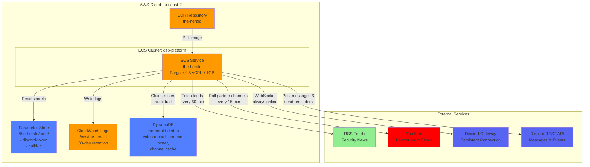

# DSB Discord Bot - The Herald


[](https://discord.gg/enMmUNq8jc)

<p align="center">
  
</p>

## Overview

The Herald is the ever-watchful and enigmatic bot, designed to guide, inform, and protect the DSB community in the sprawling digital world. True to its name, The Herald serves as a messenger and beacon, delivering essential updates and insights to empower users on their DevSecOps journey.

**Current Responsibilities:**

1. _Security Newsletter:_
   Curates and delivers a security newsletter by monitoring RSS feeds from sources like Bleeping Computer, The Hacker News, CNBC, and TechCrunch. New articles are posted to the appropriate Discord channels every hour.

2. _Event Notifications:_
   Monitors upcoming Discord scheduled events and sends DM reminders to interested users one hour before events start. Uses DynamoDB for deduplication to prevent duplicate notifications.

3. _Partner Video Announcements:_
   Watches approved DSB partner YouTube channels and announces every new long-form video in `#content-corner`. Adding a partner is one line of YAML with their `@handle` — never a code change — and there is no backfill: a partner onboarded today gets their next upload announced, not their back catalogue. See [YouTube ingestion & Discord distribution](./docs/youtube-ingestion.md).

4. _Always Online:_
   Maintains a persistent Discord gateway connection so the bot always appears online in the server member list with a "Watching over the community" status.

**Planned Features:**

1. _Video Summaries:_
   Acting as the digital voice of the DSB founder, The Herald will add AI summaries and insights to the partner video announcements it already publishes.

2. _More Ingestion Sources:_
   LinkedIn, podcasts and partner blogs, added as new ingestion services behind the same `ContentItem` contract the YouTube path established.

## Architecture

The Herald runs as a containerized FastAPI application on AWS ECS Fargate (dsb-platform cluster), using APScheduler for periodic tasks and a persistent Discord gateway connection for presence.


```mermaid
graph TB
    subgraph "AWS Cloud - us-east-2"
        subgraph "ECS Cluster: dsb-platform"
            SVC[ECS Service<br/>the-herald<br/>Fargate 0.5 vCPU / 1GB]
        end

        ECR[ECR Repository<br/>the-herald]
        PS[Parameter Store<br/>/the-herald/prod/<br/>- discord-token<br/>- guild-id]
        CW[CloudWatch Logs<br/>/ecs/the-herald<br/>30-day retention]
        DDB[DynamoDB<br/>the-herald-dedup<br/>video records, source roster,<br/>channel cache]

        ECR -->|Pull image| SVC
        SVC -->|Read secrets| PS
        SVC -->|Write logs| CW
        SVC -->|Claim, roster,<br/>audit trail| DDB
    end

    subgraph "External Services"
        RSS[RSS Feeds<br/>Security News]
        YT[YouTube<br/>Partner Atom Feeds]
        DC[Discord Gateway<br/>Persistent Connection]
        DAPI[Discord REST API<br/>Messages & Events]
    end

    SVC -->|Fetch feeds<br/>every 60 min| RSS
    SVC -->|Poll partner channels<br/>every 15 min| YT
    SVC -->|WebSocket<br/>always online| DC
    SVC -->|Post messages &<br/>send reminders| DAPI

    style SVC fill:#FF9900
    style ECR fill:#FF9900
    style PS fill:#527FFF
    style CW fill:#FF9900
    style DDB fill:#527FFF
    style RSS fill:#90EE90
    style YT fill:#FF0000
    style DC fill:#5865F2
    style DAPI fill:#5865F2
```

## Configuration

**Scheduled Jobs (via APScheduler):**

| Job | Interval | Description |
|-----|----------|-------------|
| Newsletter | 60 minutes | Fetches RSS feeds and posts new articles to Discord channels |
| Event Notifications | 5 minutes | Checks upcoming Discord events and sends DM reminders |
| YouTube Ingestion | 15 minutes | Polls approved partner channels and announces new long-form videos in `#content-corner` |

**Always-on:**

| Component | Description |
|-----------|-------------|
| Discord Gateway | Persistent WebSocket connection keeping the bot online with activity status |

**AWS Resources:**
- **Region**: us-east-2
- **ECS Cluster**: dsb-platform (Fargate)
- **Task Size**: 0.5 vCPU / 1 GB RAM
- **Networking**: Public subnet, public IP for outbound (no ingress rules)
- **Parameter Store Prefix**: `/the-herald/prod/`
- **Log Retention**: 30 days

**Environment Variables:**

| Variable | Default | Description |
|----------|---------|-------------|
| `PARAMETER_STORE_PREFIX` | `/the-herald/prod/` | AWS Parameter Store prefix for secrets |
| `DYNAMODB_TABLE_NAME` | `the-herald-reminders` | DynamoDB table for reminder deduplication |
| `LOG_LEVEL` | `INFO` | Logging level (DEBUG, INFO, WARNING, ERROR) |
| `NEWSLETTER_INTERVAL_MINUTES` | `60` | Newsletter job interval |
| `EVENT_NOTIFICATION_INTERVAL_MINUTES` | `5` | Event notification job interval |
| `HERALD_DEDUP_TABLE_NAME` | — | DynamoDB table for YouTube records, roster and channel cache |
| `HERALD_DISCORD_CHANNEL_ID` | — | Numeric id of `#content-corner` |
| `HERALD_YOUTUBE_ENABLED` | `true` | Master kill switch for YouTube ingestion |
| `HERALD_YOUTUBE_POLL_INTERVAL_MINUTES` | `15` | YouTube poll interval |
| `HERALD_YOUTUBE_EXCLUDE_SHORTS` | `true` | Announce long-form videos only |

The full set, including the optional YouTube Data API key and message styling,
is documented in [docs/youtube-ingestion.md](./docs/youtube-ingestion.md).

**HTTP Endpoints:**

| Endpoint | Description |
|----------|-------------|
| `GET /health` | Container health: scheduler, jobs, Discord gateway |
| `POST /trigger/newsletter` | Run the newsletter job now |
| `POST /trigger/event-notifications` | Run the event notification job now |
| `POST /trigger/youtube` | Run a YouTube poll now (`200` / `207` with failures / `409` already running) |
| `GET /health/youtube` | YouTube configuration, configured sources, last run summary |

## Documentation

| Document | What it covers |
|----------|----------------|
| [youtube-ingestion.md](./docs/youtube-ingestion.md) | YouTube ingestion design, configuration reference, operations and runbook |
| [discord-rate-limiting.md](./docs/discord-rate-limiting.md) | How Discord rate limits are handled |
| [issues.md](./docs/issues.md) | Review findings raised on [PR #45](https://github.com/devsecblueprint/the-herald/pull/45#issuecomment-5503342243) |
| [update.md](./docs/update.md) | The restructuring done in response: what moved where, the service split, and the judgment calls |

## Local Development

**Prerequisites:**
- Python 3.13+
- Docker
- AWS CLI configured
- `uv` package manager

### Setup

```bash
# Install dependencies
uv sync

# Run locally with Docker
invoke run
```

This starts the container with your `.env` file mounted. The app exposes:
- `GET /health` — health check (includes Discord connection status)
- `POST /trigger/newsletter` — manually trigger newsletter job
- `POST /trigger/event-notifications` — manually trigger event notifications

### Build Tasks

All operations are managed through `tasks.py` using the `invoke` task runner:

```bash
invoke build              # Build Docker image (linux/amd64)
invoke run                # Run locally with Docker
invoke push               # Build and push image to ECR
invoke deploy             # Force new ECS deployment
invoke push-and-deploy    # Build, push, and deploy (full pipeline)
invoke terraform-apply    # Apply Terraform infrastructure changes
invoke logs               # Tail CloudWatch logs
invoke logs --follow      # Stream logs in real-time
invoke clean              # Remove old build artifacts
```

## Deployment

### Manual Deploy

```bash
# Build and push image to ECR, then update ECS
invoke push-and-deploy

# Or step by step:
invoke push --tag=v2.0.0
invoke deploy
```

### Infrastructure

Infrastructure is managed with Terraform Cloud (organization: `devsecblueprint`, workspace: `the-herald`).

```bash
invoke terraform-apply
```

**Required Terraform Cloud Variables:**

| Variable | Type | Description |
|----------|------|-------------|
| `DISCORD_TOKEN` | Sensitive | Discord bot authentication token |
| `DISCORD_GUILD_ID` | String | Discord server (guild) ID |

## Project Structure

```
the-herald/
├── app/                     # Layered by kind: clients, config, models,
│                            # repositories, routes, services, utils
│   ├── main.py              # FastAPI + APScheduler + Discord presence
│   ├── bootstrap.py         # Dependency assembly, job/worker/Lambda entry points
│   ├── errors.py            # Domain exceptions, shared by every layer
│   ├── clients/             # Outbound HTTP and AWS SDK calls
│   │   ├── http.py             # The HTTP seam every other client is built on
│   │   ├── discord.py          # Discord message transports (bot token, webhook)
│   │   ├── youtube.py          # Atom feeds, @handle lookup, Shorts probe
│   │   ├── parameter_store.py  # AWS Parameter Store client
│   │   └── dynamodb.py         # DynamoDB reminder tracking client
│   ├── config/              # Configuration loading and validation
│   │   ├── logger.py           # Logging configuration
│   │   └── youtube.py          # Source list parsing and validation
│   ├── models/              # Data structures shared across layers
│   │   ├── feeds.py            # RSS models (Feed, FeedsConfig)
│   │   └── youtube.py          # ContentItem, PollResult, states, verdicts
│   ├── repositories/        # DynamoDB persistence
│   │   ├── dynamodb.py         # Conditional-write helpers
│   │   └── youtube/
│   │       ├── processing.py      # Per-video claims and state machine
│   │       ├── roster.py          # Source roster and watermarks
│   │       └── channel_cache.py   # Resolved @handle → UC… id, 30-day TTL
│   ├── routes/              # HTTP endpoints
│   │   └── youtube.py          # Trigger and health endpoints
│   ├── services/            # Business operations
│   │   ├── protocols.py        # The ingestion/publishing seams
│   │   ├── discord.py          # Discord REST API interactions
│   │   ├── newsletter.py       # RSS feed fetching and publishing
│   │   └── youtube/            # Partner YouTube ingestion → #content-corner
│   │       ├── ingestion.py        # @handle → UC… id, Atom feed → ContentItem
│   │       ├── classification.py   # Long-form vs Short
│   │       ├── publishing.py       # One video: claim → classify → publish → record
│   │       └── polling.py          # The poll: sources, ingestion, watermarks
│   ├── static/
│   │   ├── config.yaml         # RSS feed configuration
│   │   └── youtube_sources.yaml # Approved partner YouTube channels
│   └── utils/
│       ├── clock.py            # UTC time helpers, injectable for tests
│       ├── logging.py          # Structured JSON event logging
│       ├── text.py             # Small text helpers
│       └── secrets.py          # Vault secrets loader (optional)
├── docs/
│   ├── youtube-ingestion.md    # YouTube ingestion design and operations
│   ├── discord-rate-limiting.md # Discord rate limit handling
│   ├── issues.md               # PR #45 review findings
│   └── update.md               # PR #45 restructuring: what changed and why
├── tests/
│   └── youtube/             # 266 tests: no network, no AWS
├── terraform/
│   ├── main.tf              # ECS, ECR, IAM, DynamoDB, Parameter Store resources
│   ├── data.tf              # Data sources (cluster, VPC, subnets)
│   ├── variables.tf         # Input variables
│   └── provider.tf          # Terraform Cloud + AWS provider config
├── Dockerfile               # Multi-stage container build (linux/amd64)
├── requirements.txt         # Pinned runtime dependencies
├── pyproject.toml           # Project metadata and dev dependencies
└── tasks.py                 # Build/deploy automation (invoke)
```

## Want To Contribute?

If you'd like to contribute to this project, check out the [Contributing Documentation](./CONTRIBUTING.md).

## Contributors

Thank you so much for making "The Herald" what it is. You all bring this person to life.
